# 📚 Library Management System

A modern, full-stack **Library Management System** built using **React.js, Node.js, Express.js, and MongoDB**. The application provides role-based access for **Administrators** and **Members**, enabling efficient management of books, borrowing, reservations, fines, notifications, and analytics through a professional and responsive interface.

---

## 🚀 Features

### 👨‍💼 Admin Features

* Dashboard with real-time analytics
* Book Catalog Management
* Add, Edit, Delete Books
* Book Cover Image Upload
* QR Code Generation for Books
* Member Management
* Borrow & Return Management
* Reservation Approval/Rejection
* Fine Management
* Inventory Monitoring
* Notifications Management
* Activity Logs
* PDF Report Generation
* Excel Report Export
* Low Stock Monitoring
* Revenue Tracking

---

### 👤 Member Features

* Member Dashboard
* Browse Library Catalog
* Search & Filter Books
* Book Reservations
* Borrowing History
* Notifications Center
* Due Date Tracking
* Fine Tracking
* Profile Management
* Theme Preferences

---

### 📦 Inventory Features

* Track Available Copies
* Damaged Books Monitoring
* Missing Books Tracking
* Low Stock Alerts
* Inventory Health Reports

---

### 📊 Reporting & Analytics

* Revenue Reports
* Borrowing Reports
* Inventory Reports
* Member Reports
* PDF Export
* Excel Export
* Dashboard Statistics

---

### 🔐 Authentication & Security

* JWT Authentication
* Protected Routes
* Role-Based Access Control
* Password Encryption
* Secure API Endpoints

---

## 🛠️ Tech Stack

### Frontend

* React.js
* React Router DOM
* Axios
* React Icons
* Vite
* Custom CSS
* Responsive UI

### Backend

* Node.js
* Express.js
* JWT Authentication
* Multer
* QRCode Generator
* Express Async Handler

### Database

* MongoDB
* Mongoose ODM

---

# 📂 Project Structure

```bash
library-management-system
│
├── client
│   ├── public
│   ├── src
│   │   ├── assets
│   │   ├── components
│   │   ├── contexts
│   │   ├── layouts
│   │   ├── pages
│   │   ├── routes
│   │   ├── services
│   │   ├── utils
│   │   └── App.jsx
│   │
│   ├── package.json
│   └── vite.config.js
│
├── server
│   ├── src
│   │   ├── config
│   │   ├── controllers
│   │   ├── middleware
│   │   ├── models
│   │   ├── routes
│   │   ├── uploads
│   │   ├── utils
│   │   ├── app.js
│   │   └── server.js
│   │
│   └── package.json
│
├── README.md
├── .gitignore
└── package.json
```

---

# ⚙️ Installation

## 1️⃣ Clone Repository

```bash
git clone https://github.com/Vaishnavidasyam/library-management-system.git
```

```bash
cd library-management-system
```

---

## 2️⃣ Install Dependencies

### Root

```bash
npm install
```

### Client

```bash
cd client
npm install
```

### Server

```bash
cd ../server
npm install
```

---

## 3️⃣ Configure Environment Variables

Create a `.env` file inside the **server** folder.

```env
PORT=5000

MONGO_URI=your_mongodb_connection_string

JWT_SECRET=your_secret_key

CLIENT_URL=http://localhost:5173
```

---

## 4️⃣ Start Development Server

From root folder:

```bash
npm run dev
```

---

## 🌐 Application URLs

### Frontend

```text
http://localhost:5173
```

### Backend

```text
http://localhost:5000
```
 
---
 

# 📸 Screenshots

##  Landing Page

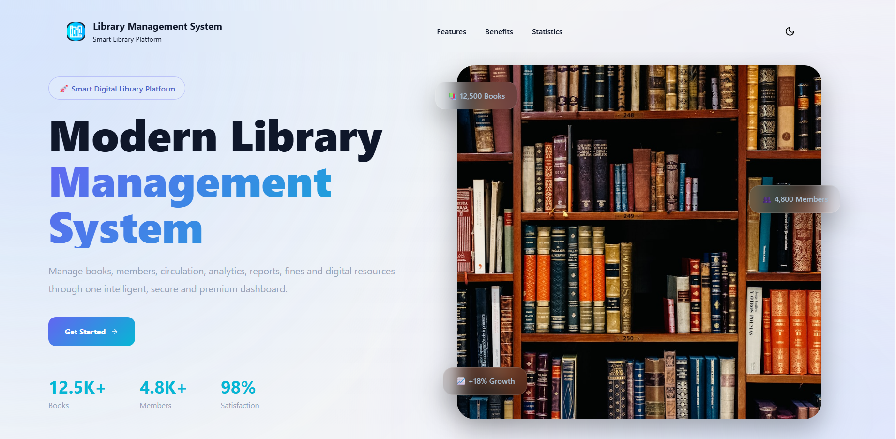

---
## 🔐 Login Page


---

## 📊 Admin Dashboard

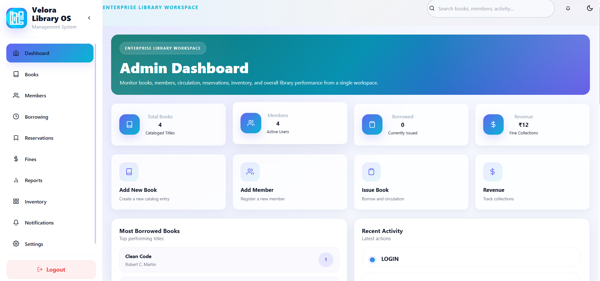

---

## 📚 Books Management

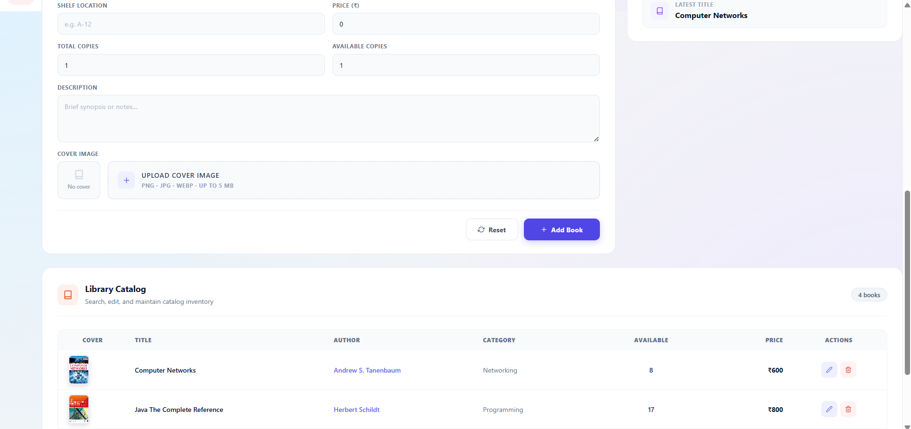
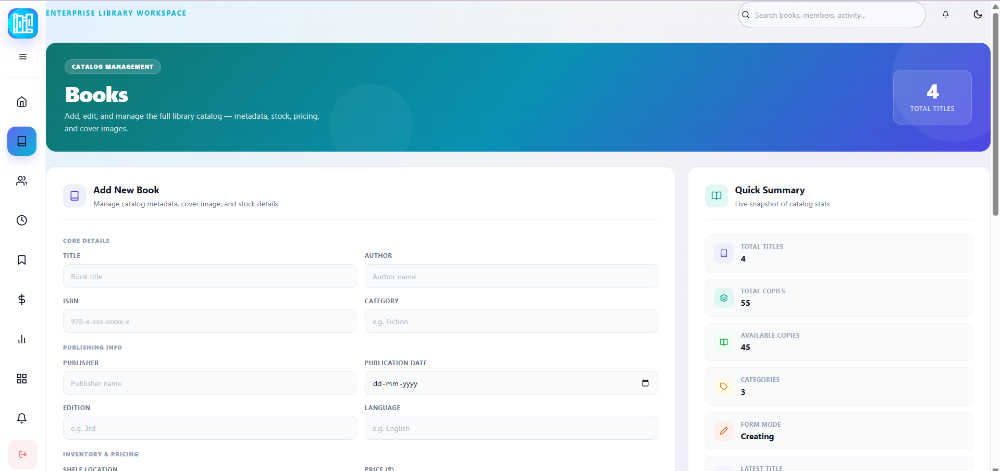

---

## 👥 Members Management

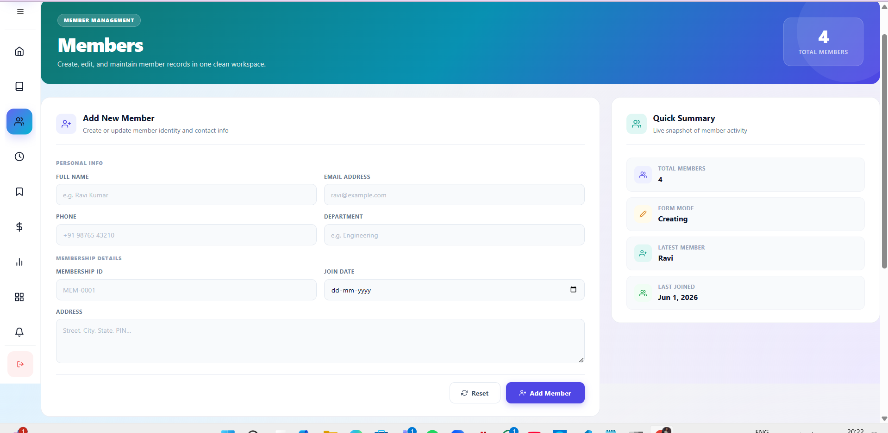
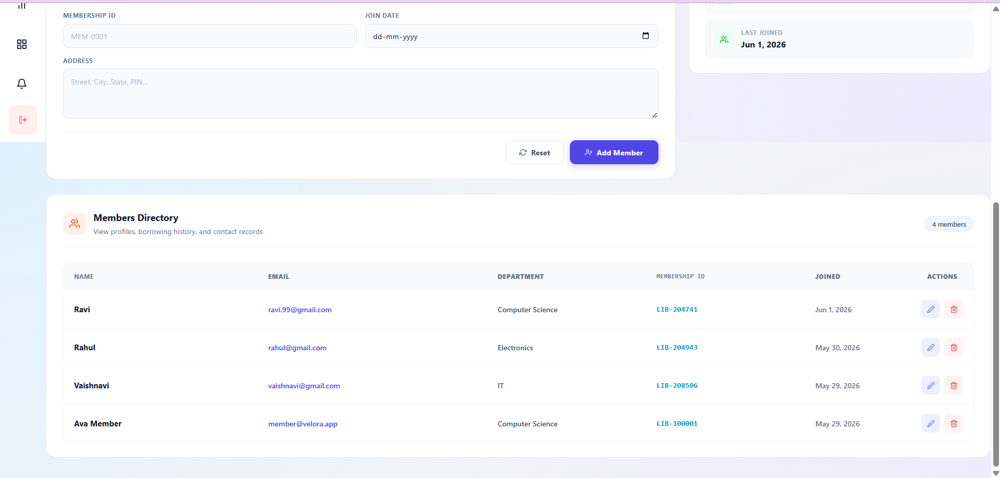

---

## 🔄 Borrowing Management

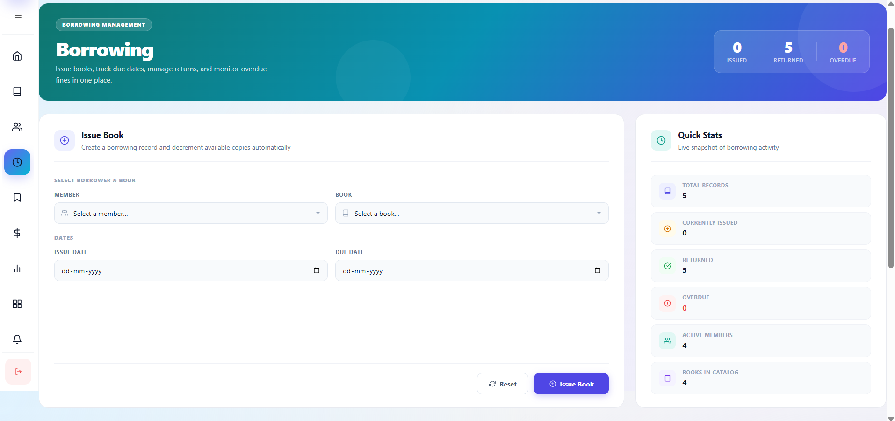
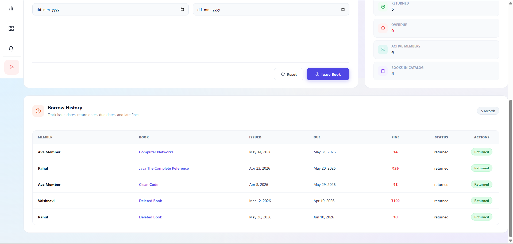

---

## 📖 Reservations Management

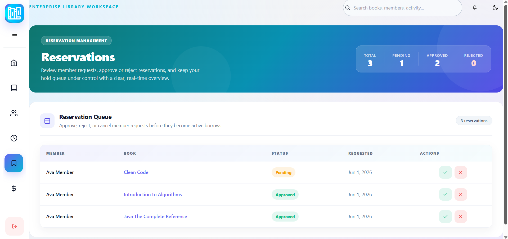

---

## 💰 Fine Management

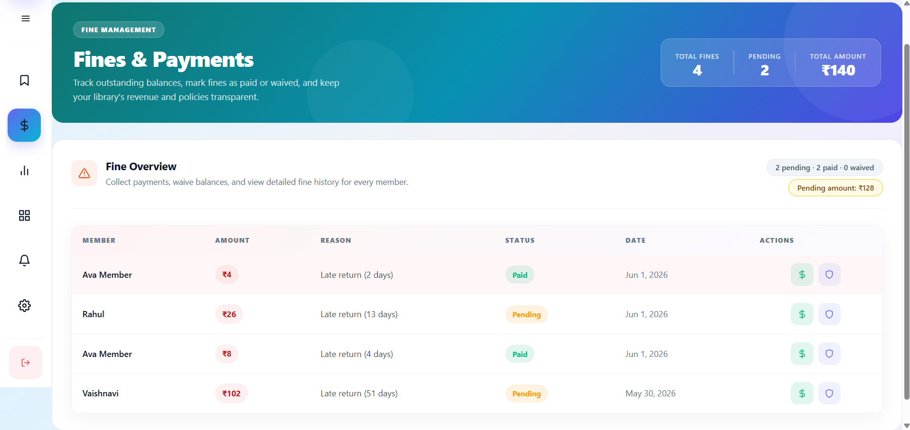

---

## 📦 Inventory Dashboard

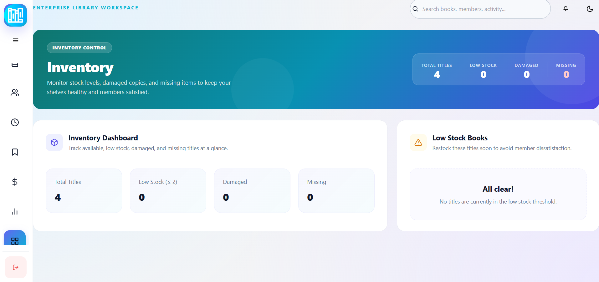

---

## 📈 Reports & Analytics

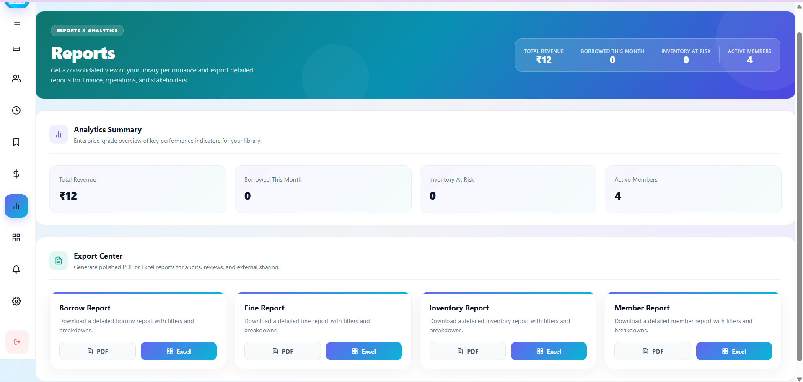

---

## 🔔 Notifications Center

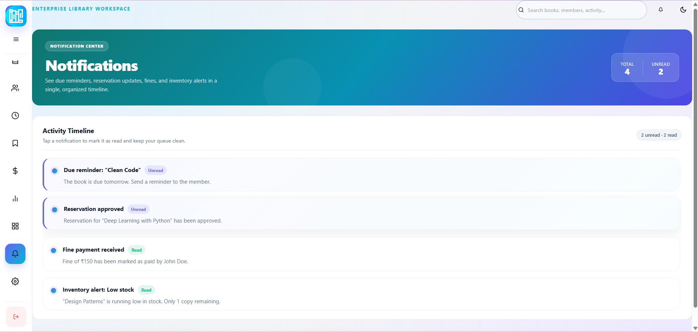

---

## 👤 Member Dashboard

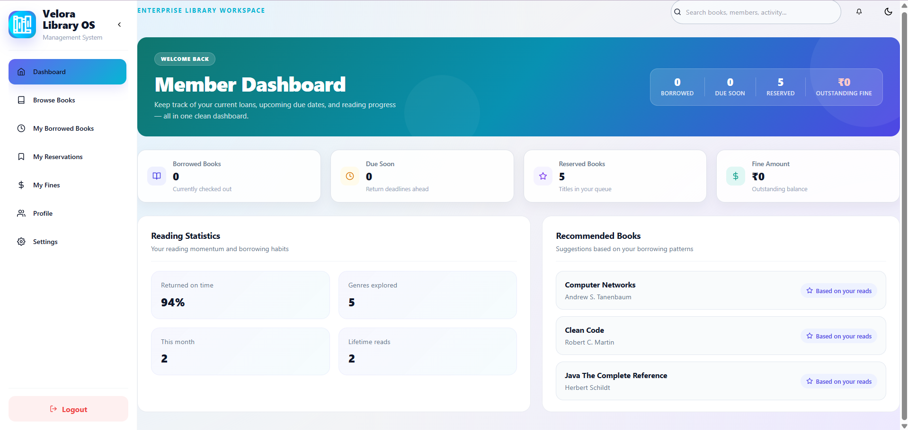

---

## 📚 Library Catalog

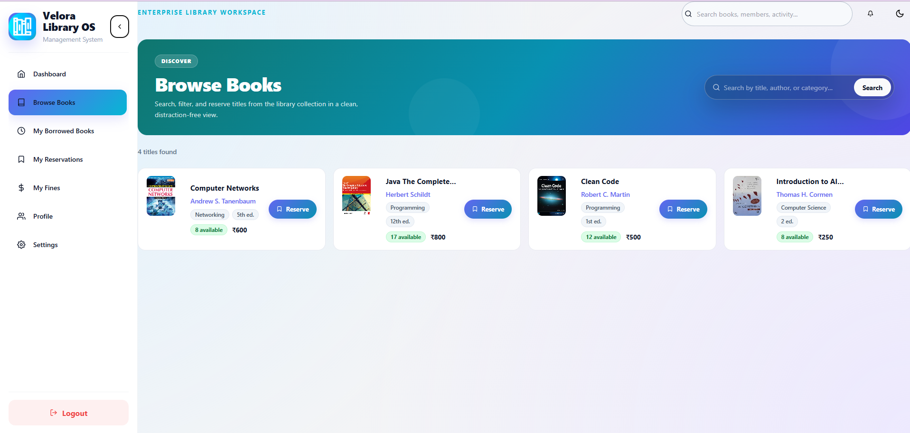

---

## 📖 Borrow History

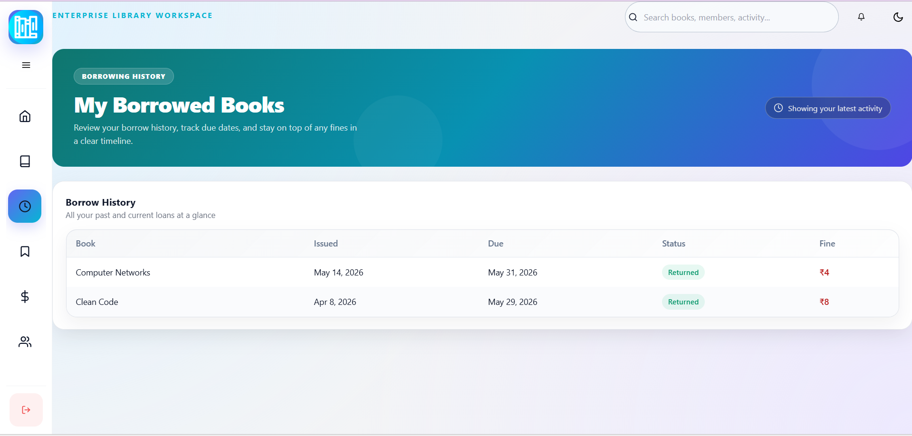

 

 
---

# 📚 Major Modules

| Module         | Description             |
| -------------- | ----------------------- |
| Authentication | Login & Authorization   |
| Dashboard      | Analytics & Statistics  |
| Books          | Catalog Management      |
| Members        | User Management         |
| Borrowing      | Issue & Return Books    |
| Reservations   | Book Reservation System |
| Fines          | Fine Collection System  |
| Reports        | Exportable Reports      |
| Inventory      | Stock Monitoring        |
| Notifications  | Alert Management        |

---

# 🔄 Workflow

```text
Admin Adds Books
        ↓
Members Browse Catalog
        ↓
Members Reserve Books
        ↓
Admin Approves Reservation
        ↓
Book Issued
        ↓
Borrow History Updated
        ↓
Return Book
        ↓
Fine Calculated (if overdue)
        ↓
Reports Updated
```

---

# 🎯 Key Highlights

* Fully Responsive Design
* Light & Dark Theme
* Modern Dashboard UI
* Book Cover Image Upload
* QR Code Generation
* PDF & Excel Reports
* Reservation Workflow
* Fine Calculation System
* Real-Time Statistics
* Role-Based Access Control
* Professional Enterprise Design

---

# 🧪 Test Credentials

### Admin

```text
Email: admin@velora.app
Password: Admin123!
```

### Member

```text
Email: member@velora.app
Password: Member123!
```

*(Update with your actual credentials before sharing.)*

---

# 👩‍💻 Author

**Vaishnavi Dasyam**

### Technologies Used

* React.js
* Node.js
* Express.js
* MongoDB
* JavaScript
* HTML5
* CSS3

---

# ⭐ Future Enhancements

* Email Notifications
* SMS Alerts
* Barcode Scanner Integration
* Mobile Application
* Multi-Library Support
* AI-Based Book Recommendations
* Advanced Analytics Dashboard
* Online Payment Gateway for Fines

---
 [](https://library-management-system-tkvu.vercel.app/)
 
